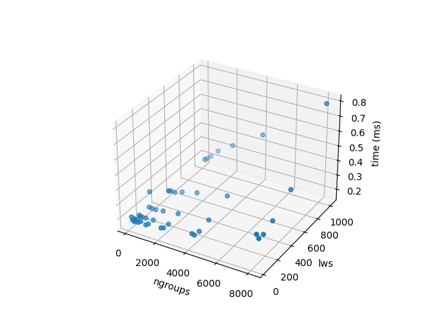
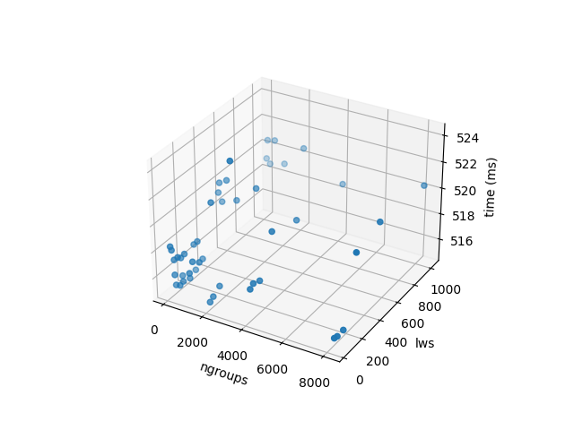

# Fourier Drawing Machine

### Author: Luca Venerando Greco 

## Indice dei contenuti

1. [Il progetto originale](#1-il-progetto-originale)
2. [Preprocessing dei contorni](#2-preprocessing-dei-contorni)
    1. [filter_contour_by_hand](#21-filter_contour_by_hand)
    2. [merge_close_contours](#22-merge_close_contours)
    3. [filter_vector_by_min](#23-filter_vector_by_min)
    4. [remove_all_duplicate_points](#24-remove_all_duplicate_points)
    5. [biggest_contour_first](#25-biggest_contour_first)
    6.  [compute_minimum_distance_beetween_contours && order_clusters_by_minimum_distance](#26-compute_minimum_distance_between_contours--order_clusters_by_minimum_distance)
3. [Parallelizzazione](#3-parallelizzazione)
    1. [Trasferimento dei dati su device](#31-trasferimento-dei-dati-su-device)
    2. [StreamCompaction](#32-streamcompaction)
        1. [Calcolo delle flag](#321-calcolo-delle-flag)
        2. [Scan inclusivo delle flag](#322-scan-inclusivo-delle-flag)
        3. [Spostamento degli elementi](#323-spostamento-degli-elementi)
    3. [Filtraggio dei punti manuale](#33-filtraggio-dei-punti-manuale)
    4. [Filtraggio dei piccoli contorni](#34-filtraggio-dei-piccoli-contorni)
    5. [Filtraggio dei punti duplicati](#35-filtraggio-dei-punti-duplicati)
    6. [Fusione di Contorni vicini](#36-fusione-di-contorni-vicini)
    7. [Ordinamento dei contorni basato sulle distanze](#37-ordinamento-dei-contorni-basato-sulle-distanze)
4. [Performance Tests](#4-performance-tests)
5. [Vettorizzazione int2 dei punti](#5-vettorizzazione-int2-dei-punti)
6. [Patch Based Matrix Computation](#6-patch-based-matrix-computation)
7. [Conclusioni](#7-conclusioni)
8. [Appendice](#8-appendice)
    1. [Memory charts](#81-memory-charts)

## 1 Il progetto originale 

Il progetto originariamente sviluppato in Processing permette, prendendo in input un’immagine, di generare una gif animata che mostra il ridisegno dell’immagine stessa. Una volta ottenuti i punti dei contorni, grazie alla trasformata di Fourier sono in grado di generare una visualizzazione che ricordi vagamente un braccio robotico che ridisegna i contorni dell’immagine. 

La pipeline per processare le immagini è la seguente:
image -> contour extraction -> contours/cluster pre-processing -> discrete Fourier transformation -> frame generation

La parte di contour extraction viene gestita dalle API di OpenCV usando un canny edge detector, il risultato è un vettore di vettori di punti che rappresentano i contorni dell’immagine.

La parte di preprocessing dei punti consiste fondamentalmente nel riordinare o filtrare i punti o i contorni dell'immagine seguendo alcune euristiche empiriche che puntano a migliorare la qualità del risulatato finale. Il progetto in questione si è occupato di parallelizzare su GPU questo segmento di codice, nella sezione successiva descriverò nel dettaglio gli step di questa fase.

Entrambi i passaggi di calcolo DFT e generazione frame sono attualmente implementati in C++ ed eseguiti sulla CPU, il loro porting in cuda non rientra nell'ambito di questo progetto.

## 2 Preprocessing dei contorni

Il preprocessing dei contorni è una fase fondamentale per ottenere un risultato finale di buona qualità. Il preprocessing consiste in una serie di operazioni che vengono applicate ai punti dei contorni ottenuti dalla fase di edge detection. A questo punto è importante specificare che i punti estratti sono organizzati in "contorni", ogni punto appartiene a uno ed un solo contorno, ogni contorno è memorizzato come un `vector` di `Point` ed ogni `Point` è un `struct` che contiene le coordinate x e y del punto. La totalità dei contorni è memorizzata in un `vector` di `vector` di `Point`.

La pipeline di preprocessing originale, pensata per girare su CPU prevede i seguenti step:
- filter_contour_by_hand
- merge_close_contours
- filter_vector_by_min
- remove_all_duplicate_points
- biggest_contour_first
- compute_minimum_distance_beetween_contours
- order_clusters_by_minimum_distance

Spenderò qualche parola per descrivere i vari step:

### 2.1 filter_contour_by_hand

Il primo step prevede di poter escludere manualmente alcuni punti che potrebbero non essere di particolare interesse per il risultato finale, a tal fine è stato aggiunto un "brush" di modificabile grandezza con il quale vengono raccolti i punti da escludere in un vettore di `Point` che viene poi passato come parametro alla funzione `filter_contour_by_hand` che si occupa di rimuovere i punti dal vettore dei contorni.

### 2.2 merge_close_contours

Questo step serve ad unire contorni che sono molto vicini tra loro, in particolare se la distanza tra i due contorni è minore di un certo valore, i due contorni vengono uniti in un unico contorno. La distanza fra due contorni era identificata come la distanza minima fra un punto del primo contorno ed un punto del secondo contorno.

### 2.3 filter_vector_by_min

Questo step serve a rimuovere i contorni che hanno meno di un certo numero di punti, in particolare se un contorno ha meno di 10 punti viene rimosso in modo da evitare artefatti dell'estrattore di contorni.

### 2.4 remove_all_duplicate_points

Questo step serve a rimuovere i punti duplicati, in particolare se due punti sono a distanza minore di una determinata soglia di pixel vengono considerati duplicati e vengono rimossi.

### 2.5 biggest_contour_first

Questo step serve a mettere in testa al vettore dei contorni il contorno più grande in modo da poter avere un passaggio quanto più "lungo" all'inizio della gif, in particolare il contorno più grande è quello che ha il numero maggiore di punti.

### 2.6 compute_minimum_distance_between_contours && order_clusters_by_minimum_distance

Questo step permette di riordinare i contorni in modo che passando da un contorno all'altro ci sia il "gap" minore possibile.


## 3. Parallelizzazione

Lo scopo di questo progetto è velocizzare gli step precedentemente elencati attraverso la computazione parallela su GPU. Una buona parte degli step precedenti hanno in una qualche forma dei passi di streamCompaction, alla quale verrà dedicata una sezione apposita.

Di seguito si elencano i passaggi, gli algoritmi e le strutture dati utilizzate per la parallelizzazione.

### 3.1 Trasferimento dei dati su device

Come precedentemente esposto, i contorni ed i punti da eliminare si trovano in memoria host ed inoltre si trovano impacchettati in strutture dati non manipolabili da cuda, se non attraverso librerie terze (eg. thrust). Per tale ragione si è deciso di adottare una rappresentazione alternativa dei contorni che permettesse un agevole utilizzo negli algoritmi utilizzati.

In particolare, i punti sono stati divisi in due array, rispettivamente per le coordinate x e y, in modo da avere un accesso più veloce alla memoria device ("fare sempre strutture di array, non array di strutture"). Inoltre è presente un ulteriore array per tenere traccia delle lunghezze dei contorni, in modo da poter delimitare i contorni gli uni dagli altri. Un'ulteriore piccola struttura dati mantiene infine il numero di contorni ed il numero totale dei punti.

Questa rappresentazione viene computata una sola volta all'inizio della pipeline e viene in seguito invertita per poter proseguire la computazione del resto del progetto.

### 3.2 StreamCompaction

La stream compaction è un’operazione che viene eseguita per estrarre un sottoinsieme di elementi interessanti da un insieme di dati più grande. La sua implementazione parallela ricade nella classe di algoritmi non banali, in quanto richiede una fase di scan per poter essere eseguita in parallelo. All'interno di questo progetto si è deciso di utilizzare la tecnica di stream compaction come segue:
- calcolo delle flag; ad ogni elemento dell'array viene associata una flag che indica se l'elemento è da mantenere o meno
- scan inclusivo delle flag; viene calcolato un array di flag che indica per ogni elemento, la sua posizione nell'array finale
- spostamento degli elementi; usando gli indici precedentemente calcolati, si spostano gli elementi nell'array finale

La tecnica utilizzata può quindi essere riassunta nella seguente immagine:


#### 3.2.1 Calcolo delle flag

Vista l'ubiquità di questa operazione all'interno del progetto, si è deciso di definire un kernel template con variadic arguments per generalizzare il calcolo delle flag; in particolare accetta un puntatore all'array di flags ed il numero di quartine, tutti gli altri argomenti vengono passati al funtore con cui viene chiamato, il codice a riguardo di seguito:

```
template <typename F, typename... Args>
__global__ void compute_flags(int nquarts, int4 *d_flag, Args... args){
    int gi = blockIdx.x * blockDim.x + threadIdx.x;
    if (gi < nquarts) {
        d_flag[gi] = F()(gi, args...);
    }
}
```

Ogni funtore che viene passato al kernel template deve implementare l'operatore `()` che prende in input l'indice globale dell'elemento e tutti gli altri argomenti passati al kernel template. La logica di chiamata del funtore prevede che anche il funtore stesso sia vettorizzato e sia in grado di computare le flag per quattro punti alla volta

#### 3.2.2 Scan inclusivo delle flag

A questo punto è possibile utilizzare un qualunque algoritmo di scan sull'array delle flag per computare la posizione che avranno gli elementi nell'array finale. In particolare si è deciso di utilizzare l'approccio sliding window visto a lezione. Poichè in questa implementazione è possibile scegliere arbitrariamente il numero di workgroup ed il local work size, sono stati successivamente riportati i risultati sperimentali per i vari valori di workgroup e local work size ottimali.

#### 3.2.3 Spostamento degli elementi

Come per il calcolo delle flag, si è cercato di fornire un approccio unificato per le varie parti in cui viene usato l'algoritmo, tuttavia in determinate sezioni è stato necessario lavorare con un approccio specifico. In generale è stato utilizzato un semplicissimo kernel dove tuttavia si effettua lo shift logico a sinistra delle posizioni computate poichè l'algoritmo prevederebbe uno scan esclusivo e per passare da uno scan inclusivo ad uno esclusivo basta effettuare lo shift delle posizioni, il codice di seguito:

```
__global__ void move_elements (int *d_in, int *d_out, int *d_flags, int *d_positions, int nels){
    int gi = threadIdx.x + blockIdx.x * blockDim.x;
    if (gi >= nels) return;
    if (!d_flags[gi]) return;
    if (gi == 0) { d_out[0] = d_in[0]; return; }
    
    int pos = d_positions[gi - 1];

    d_out[pos] = d_in[gi];
}
```

### 3.3 Filtraggio dei punti manuale

In questo step, viene dato in input il vettore di vettori di Points, che dopo essere stato opportunamente spostato su device (come esplicato al paragrafo 3.1), viene passato al kernel che si occupa di filtrare i punti. Il tutto si riduce alla computazione dell'array di flags ed alla successiva stream compaction della struttura principale dei contorni. Come accennato precedentemente, il funtore per il calcolo delle flag in questa sezione è vettorizzato, questa caratteristica permette una duplice velocizzazione del kernel, in prima istanza permette un accesso più efficiente alla memoria, secondariamente riduce di un quarto gli accessi all'array degli elementi esclusi.

### 3.4 Filtraggio dei piccoli contorni

Questo step si suddivide in due diverse fasi, prima di tutto è necessario individuare quali contorni siano da eliminare; in questo contesto i contorni da eliminare sono quelli che semplicemente presentano un numero di punti minore di una certa soglia; successivamente è necessario eliminare i punti appartenti ai contorni individuati nello step precedente. E' facile comprendere come questo si possa risolvere con due stream compaction, prima sui vettore di sizes dei contorni e poi sui punti stessi, utilizzando lo stesso array di scan delle sizes per individuare i contorni di afferenza. 

### 3.5 Filtraggio dei punti duplicati

A causa della natura dell'estrattore di edge è possibile che un singolo edge generi due punti coincidenti che sarebbe opportuno unire in un singolo punto, a tale scopo questo step si occupa di eliminare i punti duplicati all'interno degli array creando una flag array dove l'elemento di posto j è flaggato se esiste almeno un i < j tale che i punti i e j sono uguali, con tale schema è possibile limitarsi al calcolo di metà dei confronti. Successivamente viene eseguito lo stream compaction per eliminare i punti duplicati. Il calcolo delle flag dei punti duplicati è stato vettorizato senza usare la variadic template in quanto possedeva una logica troppo diversa da quella generica, inoltre usando la vettorizzazione è stato possibile ridurre di molto il numero di accessi, facendo scendere drasticamente il tempo di esecuzione.

### 3.6 Fusione di Contorni vicini

Per la natura di questo progetto è fondamentale avere "tratti" di punti quanto più lunghi possibile, dei quali coloro che si trovano all'interno di un contorno sono assicurati contigui, ma contorni vicini non necessariamente vengono disegnati in successione. Per tale ragione questo step si occupa di fondere due contorni che siano distanti meno di una determinata soglia. La distanza fra contorni viene definita come la distanza minima fra tutte le coppie di punti. Per fare ciò si è deciso di creare una matrice triangolare sui contorni, per la quale al posto A<sub>i, j</sub> = 1 se i e j sono vicini, altrimenti A<sub>i, j</sub> = 0, per ogni i > j. Per poter calcolare la matrice triangolare si è deciso di lanciare un kernel che confrontasse ogni coppia ordinata (i > j) di punti ed andasse a riempire la matrice triangolare usando un array di afferenza per recuperare il contorno di appartenenza. Di seguito il codice interessato:

```
__global__ void compute_closeness_matrix (int * d_contours_x, int * d_contours_y, int * d_reverse_lookup, char * d_closeness_matrix, int contours_linear_size, int number_of_contours, int merge_distance){
    uint64_t gi = threadIdx.x + blockIdx.x * blockDim.x;
    uint64_t nels = ((uint64_t)contours_linear_size * ((uint64_t)contours_linear_size - 1)) / 2;

    uint64_t point1 = (uint64_t)contours_linear_size - 2 - floor(sqrt((double)-8*gi + 4*(uint64_t)contours_linear_size*((uint64_t)contours_linear_size-1)-7)/2.0 - 0.5);
    uint64_t point2 = gi + point1 + 1 - (uint64_t)contours_linear_size*((uint64_t)contours_linear_size-1)/2 + ((uint64_t)contours_linear_size-point1)*(((uint64_t)contours_linear_size-point1)-1)/2;

    if (gi >= nels) return;

    if (gi >= nels || point1 == point2) return;
    
    int contour1 = d_reverse_lookup[point1];
    int contour2 = d_reverse_lookup[point2];

    if (contour1 == contour2) return;

    int x1 = d_contours_x[point1];
    int y1 = d_contours_y[point1];
    int x2 = d_contours_x[point2];
    int y2 = d_contours_y[point2];

    int distance = (x1 - x2) * (x1 - x2) + (y1 - y2) * (y1 - y2);

    if (distance < merge_distance * merge_distance){
        d_closeness_matrix[contour1 * number_of_contours + contour2] = 1;
    }
}
```
### 3.7 Ordinamento dei contorni basato sulle distanze

Per le stesse ragioni citate prima, avere un ordinamento dei contorni che minimizzi la distanza fra un contorno e un altro è cruciale per la qualità dell'output. Si è quindi deciso di ordinare i contorni in base alla distanza minima fra i punti di ogni contorno. In maniera analoga a quanto fatto in precedenza, viene computata una matrice di distanze fra i diversi contorni e viene successivamente scelto il minimo da ogni riga. Questa parte, per quanto parallelizzabile, è stata implementata lato host, in quanto il numero di contorni è molto piccolo rispetto al numero di punti e di conseguenza sarebbe stata maggiore la latenza di chiamata per effettuare la riduzione di ogni riga rispetto al calcolarla lato host. In questo step non viene utilizzata nessuna fase di stream compaction e il riordinamento dei contorni avviene su device attraverso le chiamate a cudaMemcpy con flag DeviceToDevice.

## 4 Performance Tests

Per misurare le performance del programma e metterlo a confronto con la propria controparte CPU si è deciso di utilizzare la libreria chrono, con alcune funzioni di utilità prese da una [domanda di stackoverflow](https://stackoverflow.com/a/33900479/10210279), di seguito il codice:

```
typedef std::chrono::high_resolution_clock::time_point TimeVar;

#define duration(a) std::chrono::duration_cast<std::chrono::nanoseconds>(a).count()
#define timeNow() std::chrono::high_resolution_clock::now()

template<typename F, typename... Args>
double funcTime(F func, Args&&... args){
    TimeVar t1=timeNow();
    func(std::forward<Args>(args)...);
    return duration(timeNow()-t1);
}
```

Per quanto riguarda le implementazioni parallele andremo a usare le utility di event managment di cuda.

Tutti i test sono stati eseguiti su una macchina con le seguenti specifiche:
- CPU: AMD Ryzen 5 5600G @ 3.900GHz (6 core, 12 threads) 
- GPU: NVIDIA GeForce RTX 3060 Ti 8GB
- RAM: 16GB DDR4 @ 3200MHz

Ulteriori specifiche riguardo la GPU, estratte dal riepilogo di NVIDIA control panel:
- Graphics Boost Clock: 1665 MHz
- Memory Bandwidth: 448.0 GB/s
- Bus Support: PCIe Gen 3 x16
- CUDA Cores: 4864

Di seguito gli scatter plot per ogni combinazione di lws e ngroups, a pedice la scelta migliore per ciascuno:

|  |  |   |
|:--:|:--:|:--:|
| *Filter Contour By Hand* | *Filter Vector By Min*| *Remove All Duplicate Points* |
| lws@256 ngroups@64| lws@128 ngroups@256| lws@128 ngroups@1024|


|  |   |
|:--:|:--:|
| *Merge Close Contours* | *Sort Contours By Distance* |
| lws@32 | lws@32 |

Inoltre ecco alcune misure di performance sui kernel usati:

| Funzione | Kernel | Tempo (ms) | GE/s | GB/s | Mole di dati |
|:--:|:--:|:--:|:--:|:--:| :--:|
| filter_contour_by_hand_wrapper | compute_flags | 81.969315 |  0.001020 | 1390.378905 | `#punti * #punti_esclusi`
| stream_compaction | scan | 0.023552 | 3.549932 | - | `#punti`
| stream_compaction | move_contours | 0.005120 | 16.32968 | 391.912512 | `#punti`
| filter_vector_by_min | fill_afference_array | 0.166624 |  0.166624 | 43.903256 | `#punti`
| filter_contour_duplicate | compute_duplicates_flags | 42.418270 | 5.149582 | 411.966560 | `#punti`<sup>`2`</sup>
| merge_contours | reverse_lookup | 0.017408 | 0.150391 | 38.686120 | `#punti`
| merge_contours | compute_closeness_matrix | 500.274170 | 6.648796 | 212.761472 | `#punti`<sup>`2`</sup>
| merge_contours | reallign_contours | 0.013312 | 6.127028 | 220.573024 | `#punti`
| order_clusters_by_distance | compute_distance_matrix | 468.769958 | 7.095636 | 283.826112 | `#punti`<sup>`2`</sup>

Infine, si inseriscono due grafici per mettere a confronto i tempi su cpu e gpu usando un numero incrementale di punti:

<div style="display: flex;justify-content: center;">
  
  
</div>

<br/>

## 5 Vettorizzazione int2 dei punti

Come si può notare, alcuni step dell'algoritmo non sono stati vettorizzati, questo principalmente a causa dell'occasionale non contiguità degli elementi da spostare, un esempio sarebbe quello del move_contours dopo la stream compaction, non essendo assicurata la necessità di dover spostare 4 punti contigui (il terzo potrebbe dover essere eliminato). Per tale ragione un approccio alla vettorizzazione alternativo considera nuovamente il punto come entità unica (mantenendo quindi un singolo array) formato da un int2, il primo per la coordinata x e l'altro per la coordinata y. A tale scopo è stato quindi riadattato il codice per supportare tale formato e sono stati svolti ulteriori test sulle performance per evidenziarne le differenze prestazionali, di seguito i risultati:

| Funzione | Kernel | Tempo (ms) | GE/s | GB/s | Mole di dati |
|:--:|:--:|:--:|:--:|:--:| :--:|
| filter_contour_by_hand_wrapper | compute_flags | 80.855904 |  0.001034 | 1409.528991 | `#punti * #punti_esclusi`
| stream_compaction | move_contours | 0.004960 | 16.679032 | 400.296768 | `#punti`
| filter_contour_duplicate | compute_duplicates_flags | 40.70809 | 5.253555 | 420.284416 | `#punti`<sup>`2`</sup>
| merge_contours | compute_closeness_matrix | 412.169220 | 6.716266 | 214.920512 | `#punti`<sup>`2`</sup>
| order_clusters_by_distance | compute_distance_matrix | 391.739380 | 7.116573 | 284.663680 | `#punti`<sup>`2`</sup>

Come si può notare, è presente un miglioramento tangibile su tutti i kernel coinvolti, ovviamente i kernel più impattati sono quelli che lavorano su un numero maggiore di elementi, i quali ad un piccolo aumento della bandwidth riescono a contrapporre decine di millisecondi risparmiati in esecuzione. 

Lo speedup totale massimo rilevato è del 13%, di seguito il grafico di speedup:
<div style="display: flex;justify-content: center;">
  
</div>

<br/>

Si può notare come per un numero piccolo di punti l'ottimizazione tenda a performare peggio della precedente, questo a causa della logica con cui avviene il controllo per punti duplicati all'interno di `compute_duplicate_flags`, il quale era già vettorizzato meglio nella versione precedente.

## 6 Patch Based Matrix Computation

Un'ulteriore ottimizzazione è stata effettuata nei confronti di quei kernel che si occupavano di effettuare confronti fra punti. In particolare, si è notato che il kernel compute_closeness_matrix, che si occupa di calcolare la matrice di vicinanza fra i punti, effettuava un numero di accessi in memoria quadratico rispetto al numero di punti. Per tale ragione, si è deciso di suddividere la matrice in patch quadrate di lato variabile (specificato a compile-time) e di calcolare la matrice di vicinanza per ogni patch. In questo modo, il numero di accessi in memoria è stato ridotto drasticamente, con un conseguente miglioramento delle performance. 

Ovviamente le performance di questa ottimizzazione sono dipendenti dal lato della patch e dal local worksize. Il comportamento che ci si aspetta è un miglioramento delle performance in relazione alla grandezza della patch, tuttavia è importante ricordare che con questo approccio si rischia di utilizzare troppe risorse dell'hardware, andando di fatto incontro ad un degradamento delle performance. Per tali ragioni si sono effettuati dei test per trovare le migliori coppie di parametri, di seguito i risultati:

| Funzione | Kernel | Tempo (ms) | GE/s | GB/s | Mole di dati | Patch Size | Local Worksize |
|:--:|:--:|:--:|:--:|:--:| :--:| :--:| :--:|
| filter_contour_duplicate | compute_duplicates_flags | 4.777984 | 0.174818 | 268.520576 | `#punti`<sup>`2`</sup> | 64 | 128
| merge_contours | compute_closeness_matrix | 14.673920 | 3.332518 | 426.792224 | `#punti`<sup>`2`</sup> | 8 | 256
| order_clusters_by_distance | compute_distance_matrix | 19.827711 | 0.153039 | 465.595232 | `#punti`<sup>`2`</sup> | 8 | 256

Visti i miglioramenti sostanziali in quei kernel che di fatto comprendevano la maggior parte della computazione, ci si aspetta di vedere un notevole miglioramento delle performance complessive.

Di seguito il grafico di speedup in relazione alla precedente ottimizzazione:

<div style="display: flex;justify-content: center;">
  
</div>

## 7 Conclusioni

Si riassumono gli esperimenti svolti, rappresentando in un grafico i loro tempi di esecuzione:

<div style="display: flex;justify-content: center;">
  
</div>
</br>

Come si può evidenziare dal grafico, l'uso della gpu ha senso solo per un elevato numero di punti (> ~5k) poichè per quantità minori di punti l'overhead necessario a portare i dati su device e viceversa supera lo speedup offerto dalla computazione su GPU. 

E' inoltre evidente come il numero di punti non sia più sufficiente ad apprezzare le tempistiche nel caso dell'ultima ottimizzazione, per questo sono stati svolti ulteriori test con un numero maggiore di punti, esclusivamente considerando le ultime due ottimizzazioni, poichè i tempi di computazione su CPU erano troppo elevati per poter essere considerati.

<div style="display: flex;justify-content: center;">
  
</div>

Come si può notare, l'ultima ottimizzazione porta ad un miglioramento delle performance anche per un numero di punti maggiore. 

## 8 Appendice 

### 8.1 Memory Charts 

Come si evidenziava precedentemente il kernel che si occupa di computare le flag per il filtraggio dei punti manuale presenta una bandwidth molto elevata, per studiare meglio il comportamento del kernel si è deciso di utilizzare il tool nvidia compute visual profiler, il quale permette di analizzare il comportamento del kernel in relazione alla memoria generando un grafo di accesso alle diverse aree di memoria, di seguito il grafico generato per il kernel in questione:

<div style="display: flex;justify-content: center;">
  
</div>

Come si può notare la maggior parte delle richieste di memoria vengono soddisfatte dalla cache L1.

La medesima analisi è stata svolta sui tre kernel che presentano un numero di lanci comparabile con il kernel in questione, di seguito i tre grafici generati con i nomi dei kernel corrispondenti:

<div style="display: flex;justify-content: space-between;">
    <div style="flex-direction: column; display:flex;width:30%;text-align:center;">
        
        compute_duplicates_flags
    </div>
    <div style="flex-direction: column; display:flex;width:30%;text-align:center;">
        
        compute_closeness_matrix
    </div>
    <div style="flex-direction: column; display:flex;width:30%;text-align:center;">
        
        compute_distance_matrix
    </div>
</div>

Come si evince dai grafici sembra che nel caso degli altri kernel, la cache L1 non sia sempre in grado di soddisfare le richieste del kernel, che si ritrova costretto a richiedere dati alla cache L2, denotato al colore più rossastro sul collegamento fra la cache L1 ed L2. Si nota inoltre un cache hit rate più basso di questi tre kernel rispetto al kernel in questione.

### 8.2 Esempi

Di seguito un esempio di esecuzione del programma:

<div style="display: flex;justify-content: center;">
  
  
</div>
